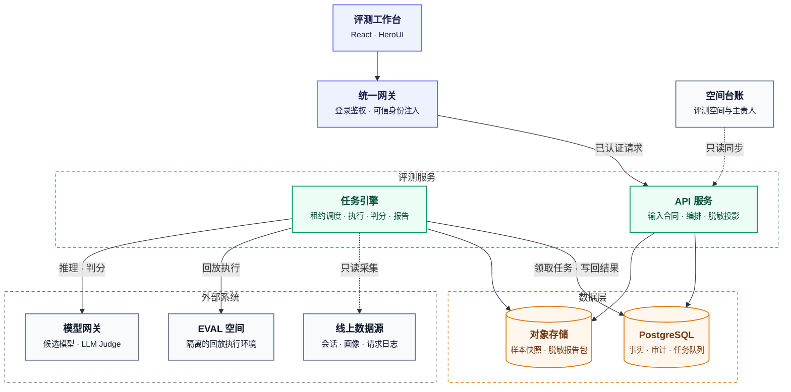

# 3Chat Agent Eval

> 面向 3Chat 客户 Agent 的回归评测平台：让每一次模型、Prompt 或配置变更，都有**可复现、可追溯、可复核**的证据。

平台将**线上样本采集与脱敏 → 金标审核与版本化 → 隔离环境回放 → LLM-as-Judge 判分 → 专家复核 → 报告归档**串联为一条闭环工作流。每一项结论都能回溯到它所依据的数据集版本、执行配置、Judge Prompt 与人工意见。

## 核心能力

- **两种互补的评测策略**：原子请求回放（Atomic Replay）回答"换一个模型，这次回答是否更好"；金标逐轮回归（Golden Regression）回答"当前 Agent 配置是否满足已审核的业务要求"。
- **语义交给模型，规则交给代码**：LLM-as-Judge 只负责语义判断；适用性、字段校验、计数、聚合与 `pass^k` 均由代码确定性完成。
- **全链路冻结与版本化**：数据集发布后不可变，Judge Prompt、模型与执行配置冻结进运行 manifest；金标修订生成新版本，历史报告不被改写。
- **人机协同复核**：Judge 结论与人工结论分别留存；人工复核以追加修订的方式记录，不覆盖原始判定。
- **隔离与脱敏**：生产数据只读采集，执行只发生在独立的 EVAL 空间；页面与报告只展示脱敏投影，凭据只存在于服务端。

## 目录

- [为什么需要这个平台](#为什么需要这个平台)
- [评测工作流](#评测工作流)
- [两种评测策略](#两种评测策略)
- [判分与可追溯性](#判分与可追溯性)
- [架构](#架构)

## 为什么需要这个平台

客户 Agent 的效果会随模型、Prompt、SOP、知识库、MCP 工具或运行配置的变化而改变。仅凭几轮人工试聊或一个平均分，无法回答三个关键问题：**哪些场景改善了、哪些场景退化了、结论的依据是什么。**

**EVAL 空间**是独立于客户生产空间的回归评测环境。评测执行使用脱敏样本、测试联系人与模拟的外部依赖，不复用真实客户联系人、原始会话数据或生产业务写入链路。平台从线上只读来源采集必要样本，经脱敏与人工审核后发布金标，再在 EVAL 空间中验证当前 Agent 配置。

**示例（虚构，不含任何真实客户数据）**：用户询问"这项申请处理好了吗"，金标要求 Agent 先查询处理状态，拿到结果前不得宣称已经办结。若 EVAL 空间中的 Agent 直接回复"已经完成"，报告会保留原始输入、实际回复、适用的 Rubric 与判定依据，并标注出失败的 Turn 及原因。复核人据此判断：这是 Agent 的问题、Judge 的误判，还是金标本身需要修订。

> **⚠️ 评测结论的边界**
>
> 平台目前不读取、也不冻结完整的 Agent 配置版本，不负责复制生产 Workspace 或发布 Agent。
> - 金标回归评测的是**本次运行时 EVAL 空间的实际配置**；
> - 原子回放评测的是**仅替换 `model` 字段后的局部请求行为**。
>
> 两者都不能等同于"整个 Agent 变更已经通过"。

## 评测工作流

```mermaid
flowchart LR
    A["<b>关联空间</b><br/><small>线上来源 · EVAL 空间</small>"] --> B["<b>采集样本</b><br/><small>线上只读</small>"]
    B --> C["<b>整理草稿</b><br/><small>脱敏 · 参考回复</small>"]
    C --> D["<b>审核发布</b><br/><small>不可变数据集版本</small>"]
    D --> E["<b>创建评测</b><br/><small>冻结配置</small>"]
    E --> F["<b>执行与判分</b><br/><small>Worker · LLM Judge</small>"]
    F --> G["<b>证据与报告</b><br/><small>逐条可追溯</small>"]
    G --> H["<b>专家复核</b><br/><small>主责 FDE</small>"]
    H -.->|修订金标| C

    classDef prepare fill:#EEF2FF,stroke:#6366F1,stroke-width:1.5px,color:#1E1B4B
    classDef golden fill:#FFF7ED,stroke:#D97706,stroke-width:1.5px,color:#78350F
    classDef run fill:#ECFDF5,stroke:#059669,stroke-width:1.5px,color:#064E3B
    classDef review fill:#FDF2F8,stroke:#DB2777,stroke-width:1.5px,color:#831843
    class A,B prepare
    class C,D golden
    class E,F,G run
    class H review
```

| 阶段 | 使用者的操作 | 平台留存的记录 |
| --- | --- | --- |
| 评测空间 | 关联线上只读样本来源、独立 EVAL 空间与主责 FDE | 空间映射、连接用途与台账状态 |
| 样本与金标 | 采集并脱敏原子请求或对话；核对画像、参考回复与 Rubric；逐案例审核 | 样本快照、草稿审核记录、不可变的数据集版本 |
| 评测运行 | 选择数据集、策略、执行次数，以及候选模型或 EVAL 配置 | 数据集 hash、执行配置、Judge Prompt 与模型、引擎指纹 |
| 判分与复核 | 查看实际输出、失败原因与 Judge 证据；主责 FDE 复核金标报告 | 逐条任务、审计事件、人工结论及其修订号 |
| 纠错与重评 | 修订有误的金标并发布新版本，按条件重新执行或重新判分 | 新旧数据集与报告并存，历史结论不被改写 |

工作台提供**评测空间、数据集、评测记录**三个入口，对应"确认空间可用 → 处理草稿与金标 → 创建评测并检查结果"。所有内部评测成员均可查看报告、审核金标；金标报告的复核由对应客户的主责 FDE 完成。

## 两种评测策略

| | Atomic Replay · 原子请求回放 | Golden Regression · 金标逐轮回归 |
| --- | --- | --- |
| **回答的问题** | 同一模型请求换成候选模型后，局部回答是否更好？ | EVAL 空间中的当前 Agent 配置，在已审核场景中是否符合业务要求？ |
| **样本** | 从 SLS 提取并脱敏的模型请求与线上参考输出 | 脱敏后的会话历史、客户输入、预期行为、画像与逐轮 Rubric |
| **执行方式** | 只替换 `model` 字段；无法等价回放的状态依赖请求会被拒绝 | 每个 Turn 独立创建测试联系人，预置并回读上一轮画像后发送当前输入 |
| **判分方式** | 分维度对称判断，聚合为 G / S / B / U | 语义指标结合代码校验，形成 Turn 与 Session 两级结论 |
| **不能据此推断** | 模型提出了工具调用，不代表工具已执行或业务已完成 | 逐轮通过，不代表模拟用户连续交互的闭环任务成功 |

**G / S / B / U** 分别表示候选相对参考**更好、相近、更差、无法可靠比较**，是相对评价而非绝对质量等级。金标回归中，由回答正确性、完备性与风险三项决定 Turn 是否通过；工具调用目前只作为诊断证据，不计入总分。

## 判分与可追溯性

**判分原则**

- **语义与规则分离**：Judge 依据冻结的 Prompt 与证据判断回答含义；字段白名单、适用性、状态校验、计数、聚合与 `pass^k` 由代码执行。
- **不确定不等于通过**：缺少证据、运行失败或 Judge 无法判断的情形单独呈现，绝不计为通过。
- **人工结论独立留存**：人工复核保留完整修订记录，不覆盖原始 Judge 结果。

**冻结与版本**

每次运行的 manifest 记录数据集内容 hash、Judge Prompt 正文与版本、Judge 模型、执行配置及引擎指纹。AI 辅助生成的画像与 Rubric 同样冻结所用 Prompt；生成后会清除该案例的既有审核，必须重新经过人工审核才能发布。

**如何阅读报告**

1. **先看覆盖**：计划执行、执行成功、判分成功、失败、待核实与已人工复核的数量；
2. **再看分布**：Atomic 的 G / S / B / U 分布，或 Golden 的逐项通过、失败、不可判断与会话汇总；
3. **最后看证据**：通过逐条证据定位退化与误判，不要只依赖单一平均数。

## 架构

平台以四类核心资源组织评测事实：

| 资源 | 含义 |
| --- | --- |
| `Dataset Version` | 已发布、不可变的评测依据 |
| `Evaluation` | 一次评测，冻结所用数据集与执行配置 |
| `Result` | 每次执行及其判分结果 |
| `Review` | 以追加方式记录的人工判断 |

PostgreSQL 保存上述事实与带租约的任务队列，Worker 领取采集、执行、判分、标注与报告任务；大对象与脱敏报告包存入私有 OSS。除 PostgreSQL 与 OSS 外，不依赖 Redis 等额外中间件。
